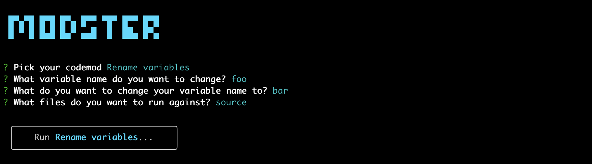
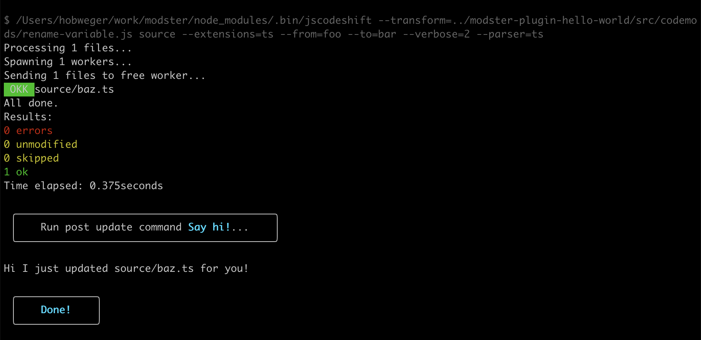

# Modster

> Codemoding, the easy way.

Modster is a plugin system and CLI for consuming and executing [`jscodeshift`](https://github.com/facebook/jscodeshift) codemods, in a way that is not terrible.

In Modster, you pick your codemod from a list of codemods, answer a few questions to have it configured, choose a file or directory to run against - and off you go! 

Easy? Yes, much. ✌️



<details>
<summary>See the full run.</summary>



</details>

## Installation

E.g. using `yarn`:

```shell
$ yarn install modster
$ yarn modster
```

## Configuration

### `.codemods.js`

Modster is configured via a configuration file, typically named `.codemods.js`. It is expected to export an object with the following fields:

| Field | Type | Required | Description |
|- |-|-|-|
| `packageManager` | `string` | ✅ | Your package manager; typically `yarn` or `npm`. |
| `sourceDirectory` | `string`   | ✅ | The directory on which you want codemods to operate. You can further limit the scope of a codemod when running Modster. |
| `extensions` | `string[]` | ✅ | The file extensions you want to run codemods against. Passed to `jscodeshift` as the `--ext` option. |
| `parser` | `string` | ✅ | The parser to use for parsig source files. One of `babel \| babylon \| flow \| ts \| tsx`. Passed to `jscodeshift` as the `--parser` option. |
| `plugins` | `string[]` | ✅ | A list of Modster plugins, following the [`eslint`-style plugin naming convention](https://github.com/obweger/plugin-name-to-package-name). See below for a list of existing plugins and how to create your own plugins. |
| `postUpdateTasks` | `function` | | A function of the shape `(updatedFiles: string[]) => { name: string; cmd: string }[]`, receiving the list of files modified by a codemod, and return a list of tasks to be executed. Every task has a name (e.g. `prettier`) and a command to be execute (e.g. `yarn run prettier ...`). |

<details>
  <summary>Like so.</summary>
  
  ```js
    export default {
        packageManager: 'yarn',
        extensions: ['tsx', 'ts'],
        sourceFolder: 'src',
        parser: 'tsx',
        plugins: [
            'hello-world'
        ],
        postUpdateTask: (files: string[]) => [
            {
                name: 'eslint autofix',
                command: `yarn eslint ${files.join(' ')} --ext tsx,ts --fix`
            }
        ]
    }
  ```

</details>

### CLI options

Modster takes two optional CLI options, `--config <path-to-file>`, and `--dry`.

| Option | Description |
|-|-|
| `--config <path-to-file>` | The path to Modster's configuration file, relative to `process.cwd()`. Defaults to `./codemods`. |
| `--dry` | If set, runs `jscodeshift` in a dry run. Post-update tasks are printed but not executed. |

## Plugins

Modster uses a plugin system to consume codemods, similar to how e.g. `eslint` consumes linting rules. It is important to understand that Modser comes with no built-in codemod functionality; running Modster without plugins therefore doesn't make a huge amount of sense. But good news! - using and even writing Modster plugins is dead simple: 

### Existing plugins

To consume a Modster plugin, you simply install it as an `npm` package, e.g. using `yarn`:

```shell
$ yarn install modster-plugin-hello-world
```

... and add it to your `.codemods.js`, following the [`eslint`-style plugin naming convention](https://github.com/obweger/plugin-name-to-package-name):

```diff
module.exports = {
    // ...
    plugins: [
        // ...
+      'hello-world'
    ]
}
```

See below for a list of Modster plugins:

| Plugin | Description |
|-|-|
| [Hello World](https://github.com/obweger/modster-plugin-hello-world) | A minimal plugin example; mostly a reference for [developing new plugins](./docs/developing-plugins/README.md). |

_To add a plugin to this list, please raise a PR._

### Developing plugins

See [Developing Modster plugins](./docs/developing-plugins/README.md).

## Contributions

Yes please!
