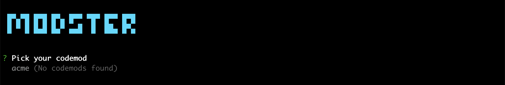

# 1️⃣ Setting up the package

## Package name

A Modster plugin is, first and foremost, an `npm` package that follows a certain naming convention; this naming convention being 

[`(<@scope>)/modster-plugin(-<plugin-name>)`](https://github.com/obweger/plugin-name-to-package-name)

A package of such name can then be configured as a Modster plugin in the `.codemods.js` file as shown below: 

```javascript
    ...
    plugins: [
        'foo',      /* refers to package modster-plugin-foo */
        '@bar',     /* refers to package @bar/modster-plugin */
        '@bar/baz'  /* refers to package @bar/modster-plugin-baz */
    ]
    ...

```

## Package entry point

The package's main entrypoint (as configured via the `package.json`'s [`main`](https://docs.npmjs.com/files/package.json#main) field) is expected to export an object with two field: A `codemods` object of codemod descriptions, and an optional plugin title `title`.

| Field | Type | Required | Description |
|- |-|-|-|
| `codemods` | `object` | ✅ | An object of shape `{ [codemodIdentifier: string]: CodemodDescription }`, where `codemodIdentifier` is an arbitrary string, and `CodemodDescription` is an object describing a codemod. Codemod descriptions are defined in detail in the [next step](./02-codemod-descriptions.md). 
| `title` | `string`   | | The plugin's title. Used in the CLI to describe the plugin; if not present, Modster falls back to the plugin name. |

<details>
<summary>Like so.</summary>
  
```js
const fooToBar = require('./foo-to-bar');

module.exports = {
    title: "ACME's fantastic Modster plugin".
    codemods: {
        'foo-to-bar': fooToBar
    }
}
```
</details>

To see if your plugin is successfully picked up by Modster, you may want to start with an empty `codemods` object, i.e.,

```js
module.exports = {
    codemods: {}
};
```

When running Modster, this plugin should show up in the codemod selection step; i.e., for a plugin `modster-plugin-acme`, you should see:



This arguably doens't make a huge amount of sense - but good news! Your plugin has been successfully picked up by Modster, and we can move on to [writing our first codemod description](./02-codemod-descriptions.md)!
